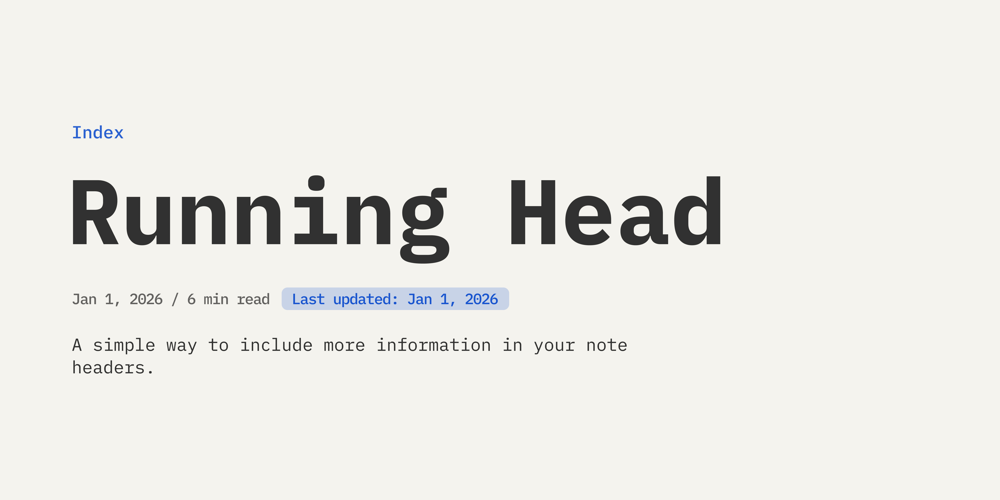

  
   

  
  

   [English](../README.md) | [Português](./README_pt.md) | [Español](./README_es.md) | Français | [简体中文](./README_zh-CN.md)

---

Transformez vos notes avec un magnifique en-tête de métadonnées style blog ! 📝✨

**Running Head** est un plugin Obsidian qui ajoute automatiquement un en-tête personnalisable à vos notes, affichant la date de publication, le temps de lecture estimé, un libellé de mise à jour, le chemin de navigation de la note, une barre de progression de défilement et toute propriété personnalisée du frontmatter que vous désirez.

## Fonctionnalités

- **📝 Plusieurs dispositions** : Choisissez entre le style **Blog** (chemin au-dessus du titre, métadonnées en dessous) ou le style **Wiki** (métadonnées au-dessus du titre, chemin en dessous).
- **⏱️ Temps de lecture et dates** : Calculez et affichez automatiquement le temps de lecture et des dates formatées selon votre langue (prend en charge les langues asiatiques).
- **🧩 Champs personnalisés** : Affichez toute propriété YAML, telle que de belles « pilules », des liens ou du texte dans l'en-tête et des cases à cocher — avec un positionnement **au-dessus** ou **en dessous** du titre individuellement.
- **📁 Portées de dossiers** : Gardez votre coffre propre en masquant certains champs personnalisés dans des dossiers spécifiques (prend en charge plusieurs dossiers par champ).
- **🍞 Chemin de la note** : Naviguez facilement avec un chemin de dossiers cliquable montrant exactement où se trouve votre note, avec une surbrillance facultative du dossier actuel.
- **📊 Barre de progression du défilement** : Une élégante barre de progression fixée en haut de la note qui suit votre position de lecture en temps réel.
- **🎨 Couleurs personnalisées** : Définissez les couleurs du libellé de mise à jour, du chemin de la note ou de la barre de progression de manière simple et individuelle.
- **📅 Format de date flexible** : Choisissez la langue de formatage parmi 18 langues disponibles ou définissez un format personnalisé en utilisant la syntaxe de [Moment.js](https://momentjs.com/).
- **💾 Gestion des données** : Exportez les paramètres complets sous forme de JSON et importez-les facilement dans un autre coffre ou appareil.
- **🤝 Intégrations puissantes** : S'intègre parfaitement avec le plugin **[Typify](https://github.com/Leike-Dev/Obsidian-Typify)** (en héritant des magnifiques styles de pilules créés par vous).
- **🌍 Internationalisation** : Interface entièrement traduite en anglais, portugais (Brésil), espagnol, français et chinois simplifié (il suffit d'utiliser Obsidian dans l'une de ces langues).

## Comment l'utiliser

### 1. Configurer les propriétés du frontmatter

Dans les paramètres du plugin, définissez les clés YAML utilisées pour :

- **Date de création** (par défaut : `date`)
- **Date de mise à jour** (par défaut : `updated`)

*Ou d'autres propriétés de type date de votre choix.*

### 2. Personnaliser l'apparence et la disposition

- **Taille du titre** : Ajuste la taille du titre de vos notes.
- **Taille des métadonnées** : Ajuste la taille des métadonnées que vous avez configurées pour apparaître dans l'en-tête.
- **Disposition de l'en-tête** : Choisissez entre Wiki (métadonnées au-dessus du titre, chemin en dessous) ou Blog (chemin au-dessus du titre, métadonnées en dessous).
- **Chemin de la note** : Affiche le chemin de dossiers de la note au-dessus du titre (masqué pour les notes à la racine du coffre).
- **Mettre en surbrillance le dossier actuel** : Applique la couleur d'accentuation au dernier segment du chemin.
- **Barre de progression du défilement** : Affiche une élégante barre de progression de lecture en haut de la note.
- **Afficher le libellé de mise à jour** : Affiche la date de dernière modification lorsque la note a été modifiée après sa création.
- **Couleur de surbrillance du dossier** : Couleur personnalisée pour le chemin (vide = couleur d'accentuation du thème).
- **Couleur de la barre de progression** : Couleur de la barre de progression (vide = couleur d'accentuation du thème).
- **Couleur du libellé de mise à jour** : Couleur d'arrière-plan du libellé de date (vide = couleur par défaut du thème).

### 3. Configurer la date et la lecture

- **Langue de formatage** : Choisissez parmi 18 langues disponibles (en-US, ja-JP, pt-BR, es-ES et autres).
- **Format personnalisé** : Utilisez la syntaxe de Moment.js (ex : `DD/MM/YYYY`, `MMMM D, YYYY`). Si vide, utilise le format par défaut de la langue.
- **Abréger les noms des mois** : Optez pour des noms de mois courts (ex : « janv. » au lieu de « janvier »).
- **Afficher le temps de lecture** : Activez ou désactivez le temps estimé affiché à côté de la date.
- **Vitesse de lecture** : Mots par minute pour calculer le temps estimé (par défaut : `200`) (prend en charge les langues asiatiques).

### 4. Champs personnalisés

1. Allez dans **Paramètres > Running Head**.
2. Sous "Champs personnalisés", cliquez sur **Ajouter**.
3. Configurez les options du champ :
   - **Clé YAML** : La propriété du frontmatter à afficher (ex : `Auteur`, `Catégorie`, `tags`).
   - **Libellé d'affichage** : Texte facultatif affiché avant la valeur.
   - **Afficher le libellé** : Activez pour afficher le libellé dans la note.
   - **Position** : Choisissez **Au-dessus du titre** ou **Sous le titre**.
   - **Masquer dans le dossier** : Masquez le champ dans des dossiers spécifiques (prend en charge plusieurs dossiers).
4. Utilisez le bouton **Gérer** pour modifier, réorganiser ou supprimer les champs existants.

### 5. Configurer la navigation par onglets

1. Allez dans **Paramètres > Running Head**.
2. Sous **Navigation par onglets**, configurez le style visuel des onglets (**Souligné**, **Pastille** ou **Minimaliste**).
3. Cliquez sur **Ajouter** sous **Nouvelle propriété d'onglet** pour enregistrer une clé de propriété du frontmatter (ex : `tabs-home`).
4. Dans le frontmatter de vos notes, définissez cette propriété comme de type **Liste** (List) dans Obsidian.
5. Dans la liste, vous pouvez ajouter :
   - Un lien vers la note de destination au format wiki : `"[[Note de Destination]]"` ou `"[[Note de Destination|Alias]]"`
   - Un nom personnalisé facultatif : `"[name, Mon Nom Personnalisé]"`
   - Un icône Lucide facultatif : `"[icon, home]"` (conseil : cliquez sur le sélecteur d'icônes dans les paramètres pour copier l'étiquette prête dans le presse-papiers)

> [!Note]
> - L'ordre dans lequel vous insérez les éléments de la liste (`[name, ...]`, `[icon, ...]` et `[[Link]]`) n'a pas d'importance pour son fonctionnement.
> - S'il y a plus d'un lien de note dans la liste de la propriété, l'onglet pointera vers le dernier lien ajouté.

### 6. Gestion des données

- **Exporter** : Générez un JSON avec toute votre configuration actuelle pour copier ou sauvegarder.
- **Importer** : Collez un JSON de configuration pour l'appliquer rapidement dans un autre coffre ou appareil.

Et voilà, vos métadonnées sont maintenant affichées avec élégance dans vos notes. ✨

## Installation

### Installation manuelle
1. Téléchargez la dernière version : `main.js`, `manifest.json` et `styles.css`.
2. Créez un dossier nommé `running-head` dans le répertoire `.obsidian/plugins/`.
3. Collez-y les fichiers.
4. Rechargez Obsidian et activez le plugin dans **Paramètres > Plugins communautaires**.

## Avis

> [!Tip]  
> Si vous avez installé le plugin **[Typify](https://github.com/Leike-Dev/Obsidian-Typify)**, Running Head détectera et appliquera automatiquement vos styles Typify aux pilules correspondantes dans l'en-tête de métadonnées (si vous le souhaitez).

> [!Tip]  
> Le thème Minimal, de Kepano, a été celui qui a donné le plus de maux de tête pour l'ajuster et le rendre le meilleur possible. Il fonctionne parfaitement dessus, d'accord ?

> [!Tip]  
> Utilisez la fonction d'**Exportation/Importation** pour partager vos paramètres entre vos coffres ou sauvegarder votre configuration avant d'expérimenter de nouvelles modifications.

## Développement

Si vous souhaitez compiler le plugin vous-même, procédez comme suit :

1. Clonez ce dépôt.
2. Exécutez `npm install`.
3. Exécutez `npm run dev` pour lancer la compilation en mode *watch*.

## Avertissement

Ce plugin a été conçu pour apporter une sensation plus élégante et « publiée » aux notes de votre coffre Obsidian. Et comme d'autres fois, il est né de mon désir de personnaliser mon coffre (parfois, les désirs nous font créer des choses incroyables, tout comme passer des heures et des heures jusqu'à ce que ce soit comme nous le voulons... lol).

Un grand merci à [Antigravity](https://antigravity.google/) pour l'assistance inestimable dans la création, la refactorisation et l'optimisation de ce code source. Mais rien ne se fait par magie, ce plugin a été testé, retesté, retourné dans tous les sens pour être le plus optimisé, léger, bon, beau et fonctionnel possible pour tous ceux qui recherchent quelque chose comme ça.

Si vous trouvez un bug, veuillez ouvrir une *issue* et je ferai de mon mieux pour le corriger. Les contributions via des *pull requests* sont toujours les bienvenues ! 😉
